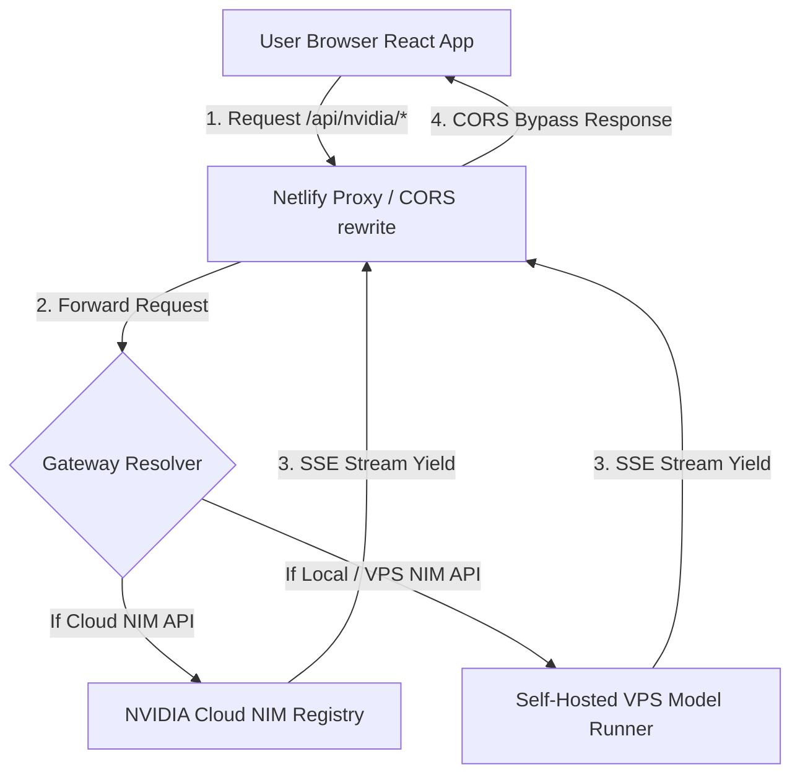
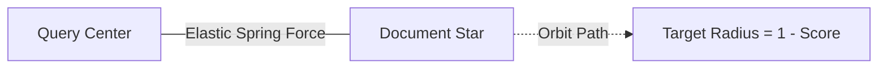

# milkyway.ai // Developer & Architecture Documentation

Welcome to the **milkyway.ai** comprehensive developer documentation. This guide is written in clear, plain English, aiming to provide future engineers with a smooth hand-off, covering all system architecture flows, API integrations, physics simulations, rendering mathematics, and stylesheet systems.

---

## Table of Contents
1. [Executive Summary](#1-executive-summary)
2. [System Architecture & Lifecycle](#2-system-architecture--lifecycle)
3. [API Integrations & Streaming Protocols](#3-api-integrations--streaming-protocols)
4. [Component Systems & Mechanical Mathematics](#4-component-systems--mechanical-mathematics)
    - [Constellation Visualizer](#constellation-visualizer)
    - [Text Embeddings & Physics Mapping](#text-embeddings--physics-mapping)
    - [Reasoning Waveform Engine](#reasoning-waveform-engine)
    - [CodeLab Compiler View](#codelab-compiler-view)
    - [Vision Lab Scanner](#vision-lab-scanner)
5. [State Management & Global Hooks](#5-state-management--global-hooks)
6. [Mobile Design System & CSS Variables](#6-mobile-design-system--css-variables)
7. [Local Setup & Deployment Instructions](#7-local-setup--deployment-instructions)

---

## 1. Executive Summary

**milkyway.ai** is a deep-space developer dashboard designed to interactively showcase, benchmark, and prototype application models packaged as NVIDIA Inference Microservices (NIMs). The workspace is designed around an astronomical theme where models are represented as stars in a unified galaxy.

The application contains five main playgrounds:
1. **Constellation**: An interactive 2D star map representing the model directory.
2. **Chat Arena**: A side-by-side prompt laboratory with custom system prompts and parameter controls.
3. **CodeLab**: A programming workspace with code-specific compilation output.
4. **Reasoning Engine**: A multi-step logic laboratory designed to output reasoning chains.
5. **Embedding Search**: A 2D coordinate-space mapping document similarities using cosine distance.
6. **Vision Lab**: A visual query playground including a canvas-based crop/scan simulator.

---

## 2. System Architecture & Lifecycle

The application operates as a Serverless Single Page Application (SPA). Because directly querying external APIs like NVIDIA's API gateway (`integrate.api.nvidia.com`) from a client browser throws CORS (Cross-Origin Resource Sharing) blockages, all requests are proxied.

### Request Lifecycle Flow


### Serverless Rewrite Definition
In [netlify.toml](file:///c:/Users/User/.gemini/antigravity/scratch/nvidia-nim-showcase/netlify.toml), a rewrite route transparently maps all `/api/nvidia/*` path requests directly to the NVIDIA API gateway, automatically appending splat coordinates:

```toml
[[redirects]]
  from = "/api/nvidia/*"
  to = "https://integrate.api.nvidia.com/v1/:splat"
  status = 200
  force = true
```

During local development, the Vite server uses built-in proxy overrides matching the same routing schema to prevent CORS blockages.

---

## 3. API Integrations & Streaming Protocols

All communication with the underlying model endpoints is declared in [nvidia.js](file:///c:/Users/User/.gemini/antigravity/scratch/nvidia-nim-showcase/src/api/nvidia.js). The module uses **Server-Sent Events (SSE)** and JavaScript Generator functions (`async function*`) to stream tokens in real time.

### Streaming Mechanics
Each response from the API is read chunk by chunk using a `ReadableStreamDefaultReader` and translated back to plain text via a standard `TextDecoder`. Because network packets can slice JSON chunks mid-character, the parser maintains an internal buffer to sew lines together:

```javascript
buffer += decoder.decode(value, { stream: true })
const lines = buffer.split('\n')
buffer = lines.pop() // Hold the incomplete trailing line in buffer
```

### Reasoning Stream Extraction
Reasoning models (like DeepSeek R1) output special `<think>` and `</think>` tags enclosing their internal logic before yielding the final answer. To prevent this raw tag clutter in the main viewport, the `streamReasoning` generator intercepts the tokens and classifies them:

```javascript
if (delta.includes('<think>')) {
  inThink = true;
  yield { type: 'thinking', content: delta.replace('<think>', '') }
} else if (delta.includes('</think>')) {
  inThink = false;
  const parts = delta.split('</think>')
  if (parts[0]) yield { type: 'thinking', content: parts[0] }
  if (parts[1]) yield { type: 'answer', content: parts[1] }
} else {
  yield { type: inThink ? 'thinking' : 'answer', content: delta }
}
```

This yields a structured stream of typed segments, feeding the reasoning waveform and process step logs separately.

---

## 4. Component Systems & Mechanical Mathematics

This section explains the visual features and underlying mathematical models utilized in the visual layers of the dashboard.

### Constellation Visualizer
Located in [Constellation.jsx](file:///c:/Users/User/.gemini/antigravity/scratch/nvidia-nim-showcase/src/components/constellation/Constellation.jsx), this dashboard renders a dynamic, interactive celestial map of available models on an HTML5 `<canvas>` using a custom physical camera system.

#### 1. Coordinate Transforms
To support panning and zooming, the visualizer maps screen mouse positions to the virtual "world" coordinate space and back. 

- **World Coordinates to Screen Coordinates**:
  Given a node at world coordinates \((X_w, Y_w)\), a camera center \((Cam_x, Cam_y)\), screen dimensions \((W, H)\), and a zoom level \(Z\):
  \[X_s = (X_w - Cam_x) \cdot Z + \frac{W}{2}\]
  \[Y_s = (Y_w - Cam_y) \cdot Z + \frac{H}{2}\]

- **Screen Coordinates to World Coordinates (Mouse Unprojection)**:
  To find which star the cursor \((M_x, M_y)\) is hovering over in the virtual sky:
  \[X_w = \frac{M_x - W/2}{Z} + Cam_x\]
  \[Y_w = \frac{M_y - H/2}{Z} + Cam_y\]

#### 2. Damped Camera Physics
Camera movements use linear interpolation (LERP) to produce smooth transition animations when clicking categories or models:
\[Cam_{\text{actual}} = Cam_{\text{actual}} + (Cam_{\text{target}} - Cam_{\text{actual}}) \cdot K\]
Where the dampening factor \(K \approx 0.08\) per frame.

---

### Text Embeddings & Physics Mapping
Located in [EmbeddingSearch.jsx](file:///c:/Users/User/.gemini/antigravity/scratch/nvidia-nim-showcase/src/components/embeddings/EmbeddingSearch.jsx), this playground maps text nodes in a 2D vector space.

#### 1. Cosine Similarity Mathematics
Embeddings translate sentences into high-dimensional coordinate arrays. When a user runs a similarity search, the application calculates the cosine similarity between the query vector \(\mathbf{Q}\) and each document vector \(\mathbf{D}\):

\[\text{Cosine Similarity}(\mathbf{Q}, \mathbf{D}) = \frac{\mathbf{Q} \cdot \mathbf{D}}{\|\mathbf{Q}\| \|\mathbf{D}\|} = \frac{\sum_{i=1}^{N} Q_i D_i}{\sqrt{\sum_{i=1}^{N} Q_i^2} \sqrt{\sum_{i=1}^{N} B_i^2}}\]

The output is a scalar match percentage between \(-1\) and \(1\) (typically normalized between \(0\) and \(1\) for text matches).

#### 2. Vector Space Attraction Physics
To visualize these similarities, the canvas acts as a physics simulator where nodes are placed in orbit. When a query is searched:
1. The query vector acts as a central gravitational pull at the center of the canvas \((C_x, C_y)\).
2. The **target distance** \(D_{\text{target}}\) from the center for each document node is proportional to its similarity score:
   \[D_{\text{target}} = (1 - \text{score}) \cdot R_{\text{max}}\]
   Where \(R_{\text{max}} = 240\) pixels. If a document has a \(100\%\) match (score = 1.0), its target distance is 0 (directly in the center).
3. **Elastic Physics Force**: Every frame, nodes accelerate towards their target distance:
   \[F_x = \frac{dx}{D_{\text{current}}} \cdot (D_{\text{target}} - D_{\text{current}}) \cdot K_{\text{elastic}}\]
   \[F_y = \frac{dy}{D_{\text{current}}} \cdot (D_{\text{target}} - D_{\text{current}}) \cdot K_{\text{elastic}}\]
   Where \(K_{\text{elastic}} = 0.08\), and a friction factor of \(0.88\) is applied to velocities to prevent perpetual oscillation.



---

### Reasoning Waveform Engine
In [ReasoningEngine.jsx](file:///c:/Users/User/.gemini/antigravity/scratch/nvidia-nim-showcase/src/components/reasoning/ReasoningEngine.jsx), a synthetic brainwave waveform is drawn in real time during model inference.

#### Waveform Synthesis Equation
The canvas renders multiple overlapping sine waves. The vertical coordinate \(y\) of each line at horizontal coordinate \(x\) is calculated using a dynamic amplitude, frequency, and phase offset:

\[y(x) = y_{\text{center}} + A \cdot \sin(x \cdot f + \phi + \phi_{\text{offset}}) \cdot \text{Damp}(x)\]

Where:
- \(A\) (amplitude) expands from \(2\) to \(12\) pixels when the model is thinking.
- \(f\) (frequency) fluctuates between \(0.012\) (resting) and \(0.035\) (active).
- \(\phi\) (phase offset) increments every frame to animate the wave leftward.
- \(\text{Damp}(x)\) is a bell curve dampening function keeping wave edges bound to the boundaries of the canvas:
  \[\text{Damp}(x) = \sin\left(\frac{x}{W} \cdot \pi\right)\]
  This dampens the waves to \(0\) at the left (\(x=0\)) and right (\(x=W\)) borders, keeping the visual centered.

---

### CodeLab Compiler View
In [CodeLab.jsx](file:///c:/Users/User/.gemini/antigravity/scratch/nvidia-nim-showcase/src/components/code/CodeLab.jsx), a developer interface splits space between code instruction logs and the preview terminal.
- **Markdown Renderer**: Processes standard codeblocks, applying syntax styling using Prism style tokens.
- **Toggle Parameter Deck**: Responsive states automatically collapse parameter columns (`showParams`) on mobile viewports:
  ```javascript
  const [showParams, setShowParams] = useState(() => window.innerWidth >= 768)
  ```

---

### Vision Lab Scanner
In [VisionLab.jsx](file:///c:/Users/User/.gemini/antigravity/scratch/nvidia-nim-showcase/src/components/vision/VisionLab.jsx), a canvas overlay mimics a scanner frame. It allows developers to feed an image base64 coordinate array to a vision model (such as NVIDIA's Nemotron Vision NIM) and stream back descriptions or text extraction:
- **Base64 Packaging**: Encapsulates selected images inside standard data URI messages:
  ```javascript
  { type: 'image_url', image_url: { url: `data:${mimeType};base64,${imageBase64}` } }
  ```

---

## 5. State Management & Global Hooks

The application state is distributed in modular custom hooks:
1. [useApiKey.js](file:///c:/Users/User/.gemini/antigravity/scratch/nvidia-nim-showcase/src/hooks/useApiKey.js): Coordinates retrieving/saving user API keys inside browser `localStorage`.
2. [useModels.js](file:///c:/Users/User/.gemini/antigravity/scratch/nvidia-nim-showcase/src/hooks/useModels.js): Dispatches async queries to retrieve list profiles of available models, sorting them by categories (chat, reasoning, embedding, etc.).
3. [useStream.js](file:///c:/Users/User/.gemini/antigravity/scratch/nvidia-nim-showcase/src/hooks/useStream.js): State machine wrapper handling the active message array, streaming flags, connection status, and error states.

---

## 6. Mobile Design System & CSS Variables

The user interface uses a custom glassmorphism design system declared in [index.css](file:///c:/Users/User/.gemini/antigravity/scratch/nvidia-nim-showcase/src/index.css).

### Color Tokens & Theme Keys
```css
:root {
  --bg-void: #0a0907;          /* deep space black background */
  --bg-panel: #110f0c;         /* panel baseline */
  --bg-clay: rgba(26, 23, 16, 0.4); /* translucent card color */
  --border-subtle: rgba(255, 255, 255, 0.05);
  --border-base: rgba(245, 169, 61, 0.12);
  --border-active: rgba(245, 169, 61, 0.4);
  
  --amber-c: #f5a93d;          /* signature star color glow */
  --accent-phosphor: #00ff87;  /* embedding search green accent */
}
```

### Mobile Layout Media Overrides (`(max-width: 767px)`)
- **Split Stack**: Flexible panes (`.arena-split`, `.codelab-split`, `.embeddings-split`, `.reasoning-split`) override to `flex-direction: column !important` on mobile.
- **Scroll Constraints**: Wide SVG diagrams inside the "Our Story" page wrap inside a `100%` width parent with `overflow-x: auto`, keeping standard card envelopes clean on narrow screens.
- **Add-Doc Toggle**: Embedding custom document inserts collapse into a simple toggle button, saving screen height.
- **Select Inputs**: Model selectors scale dynamically (`.model-select-dropdown`) instead of retaining wide fixed desktop dimensions.

---

## 7. Setup & Run Instructions

To run the codebase locally:

### 1. Installation
Install project dependencies:
```bash
npm install
```

### 2. Development Execution
Launch the local development server:
```bash
npm run dev
```
The server will boot, by default routing local proxy redirects to:
👉 `http://localhost:5173/`

### 3. Production Build
Compile the minified assets bundle:
```bash
npm run build
```
This produces optimized production assets inside the `/dist` directory. Netlify picks up this folder automatically on deploy.
